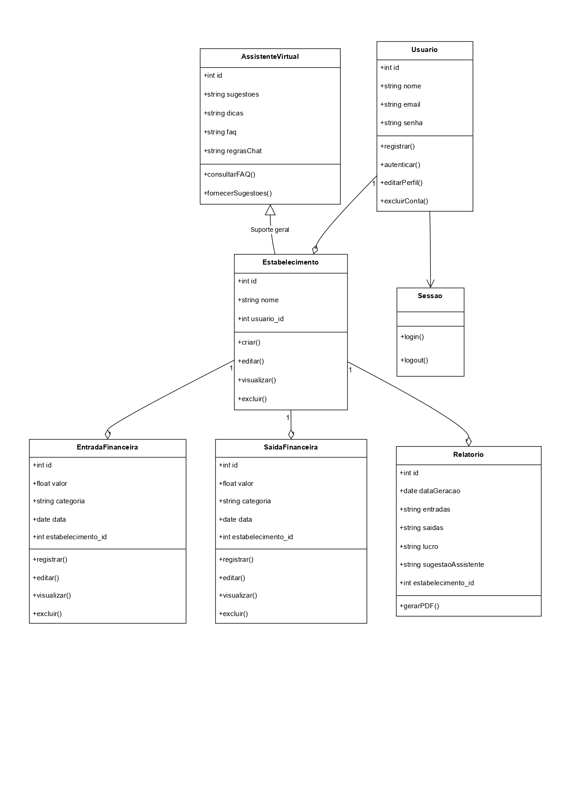

# 🧠 Assistente Virtual para Pequenos Negócios – Hackathon TIC 2025

> Projeto desenvolvido durante o Hackathon do curso técnico em Tecnologia da Informação e Comunicação (TIC), com foco em **Transformação Digital, Inovação e Empreendedorismo**.

---

## 🌍 Sobre o Projeto

O projeto visa desenvolver um **assistente virtual inteligente** para auxiliar pequenos empreendedores locais na gestão dos seus negócios. A proposta é facilitar o processo de digitalização, organização financeira e planejamento estratégico para micro e pequenos negócios do município.

A ideia surgiu a partir de problemas reais observados na cidade, como:
- Falta de controle financeiro e de gestão;
- Baixa digitalização dos processos comerciais;
- Barreiras culturais e técnicas à adoção de tecnologia.

---

## 🧩 Estrutura e Documentação

| Seção | Descrição |
|-------|----------|
| [📌 Introdução e Contextualização](docs/01_contexto.md) | Panorama da cidade e problemas identificados |
| [🎯 Objetivo do Projeto](docs/02_objetivos.md) | Objetivo geral e objetivos específicos |
| [📦 Escopo do Projeto](docs/03_escopo.md) | O que está dentro e fora da proposta |
| [⚙️ Requisitos do Sistema](docs/04_requisitos.md) | Requisitos funcionais e não funcionais |
| [🧠 Metodologia e Tecnologias](docs/05_metodologia.md) | Abordagens e ferramentas usadas |
| [🗂️ Canvas do Projeto](docs/06_canvas.md) | Estrutura visual do modelo de negócio |
| [🚧 Protótipo / MVP](docs/07_prototipo.md) | Interface, prints e status do desenvolvimento |

---

## 💻 Tecnologias Utilizadas

| Categoria | Tecnologia | Finalidade |
|:---|:---|:---|
| Linguagem de Programação | Python | Desenvolvimento do backend e integração com IA |
| Framework Web | Flask | Criação do servidor, rotas e renderização das páginas HTML |
| Frontend | HTML5, CSS3, Bootstrap 5 | Interface responsiva, estilização e usabilidade |
| Banco de Dados | SQLite | Armazenamento local de entradas, saídas e informações financeiras |
| Integração de IA | Hugging Face API | Geração de respostas automáticas para o Assistente Virtual |
| Hospedagem | PythonAnywhere | Deploy da aplicação Flask com banco de dados SQLite |
| Versionamento de Código | Git + GitHub | Controle de versões e colaboração em equipe |
| Gerador de Código Assistido | Cursor.ai | Agilizar a geração de código backend, frontend e integração com IA |

---

## 📄 Licença

Projeto desenvolvido para fins educacionais, com código aberto para estudos, contribuições e reaproveitamento com créditos.

---

